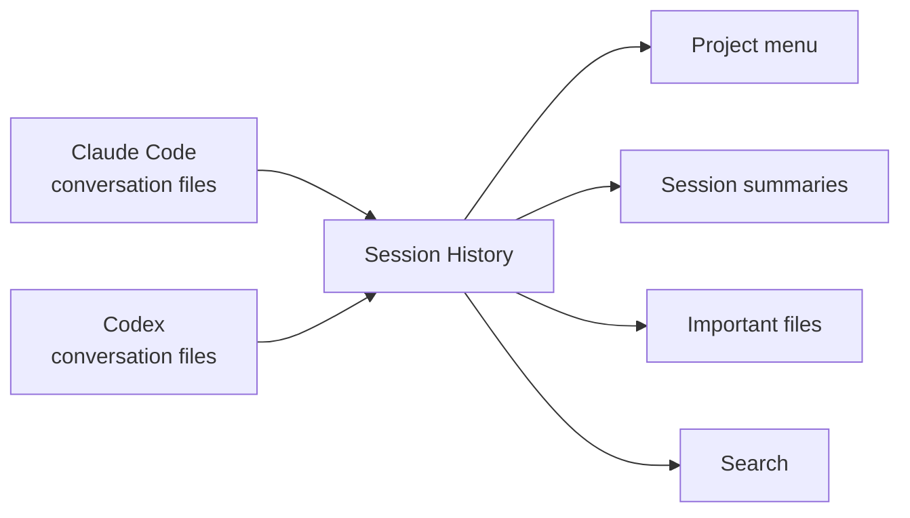

Built by [Andy Toizer](https://www.linkedin.com/in/andy-toizer/) — I'm the head of growth at [Freckle.io](https://freckle.io/) and write [AgentOperator](https://agentoperator.substack.com/), a newsletter about what it actually looks like to build real systems with coding agents as a non-engineer.

# Session History

TLDR: Session History gives anyone using coding agents a simple way to find old Claude Code and Codex work. It turns your local agent conversations into a searchable project library, so you can answer questions like "Where was that outbound list?", "What did we decide in that pricing project?", or "Which session made this deck?"

## What It Does

- Finds your local Claude Code and Codex transcripts
- Infers real workstreams instead of blindly using the folder where the agent was launched
- Groups conversations into projects, threads, and cross-workstream artifact hubs
- Creates readable Markdown summaries
- Copies the raw transcript next to each summary for backup
- Highlights useful output files like CSVs, decks, PDFs, docs, reports, HTML files, and images
- Lets you search across old prompts, answers, project names, and file paths
- Runs locally with no API keys and no paid service

## Why You Would Use It

Agent work gets scattered fast. One week you might use agents for account research, a LinkedIn campaign, a lifecycle email, a HubSpot cleanup, and a customer deck. A month later, the useful context is buried in old chats.

Session History gives you a lightweight memory layer:

- "Show me the project history."
- "Find the session where we built the churn report."
- "Open the LinkedIn campaign thread."
- "Where did the agent save that CSV?"
- "Summarize what we already tried for this segment."

## How It Works



The generated library lives at:

```text
~/.session-history/session-history.md
```

## How It Thinks About Projects

Session History does not assume the transcript working directory is the project. Agent sessions are often launched from broad folders like `Documents`, `Projects`, or `New project`, so the script looks at titles, prompts, project markers, file paths, and session-relay context to infer the actual workstream.

That means broad buckets like "content" or "CRM" can become more useful lanes such as `Newsletter Draft / Copy`, `LinkedIn Post Review`, `CRM Dedupe Dry Runs`, or `Outbound Campaign Research`.

## Quick Start

### 1. Clone The Repo

```bash
git clone https://github.com/Andytoizer/session-history
cd session-history
```

### 2. Build Your Session Library

```bash
python3 scripts/session_history.py menu
```

### 3. Open The Result

```bash
open ~/.session-history/session-history.md
```

That is the main workflow.

## Common Commands

Show the top-level project menu:

```bash
python3 scripts/session_history.py menu
```

Open one project by row number:

```bash
python3 scripts/session_history.py project 3
```

Open one thread inside a project:

```bash
python3 scripts/session_history.py thread 3 2
```

Search old sessions:

```bash
python3 scripts/session_history.py find "pricing calculator"
```

Open a project page on macOS:

```bash
python3 scripts/session_history.py open "newsletter"
```

## Use It As A Codex Skill

Install it into Codex:

```bash
mkdir -p ~/.codex/skills
git clone https://github.com/Andytoizer/session-history ~/.codex/skills/session-history
```

Then ask Codex:

```text
Use $session-history to show my project history.
Use $session-history to find "hubspot cleanup".
Use $session-history to open the newsletter project.
```

## What It Reads

By default, it looks in the normal local transcript folders:

```text
~/.codex/sessions/**/*.jsonl
~/.codex/archived_sessions/*.jsonl
~/.claude/projects/**/*.jsonl
```

It writes a generated library to:

```text
~/.session-history
```

## What It Creates

```text
~/.session-history/
├── session-history.md
├── index.json
├── projects/
│   └── <project>/
│       ├── README.md
│       ├── sessions/
│       ├── threads/
│       └── transcripts/
└── artifacts/
```

You usually only need `session-history.md`. The rest is there when you want to dig deeper.

## Privacy Notes

This is local-first, but the generated library can contain sensitive information because it copies raw transcripts and extracts prompts, answers, file paths, and tool names.

Do not publish your generated `~/.session-history` folder unless you have reviewed it carefully.

This public repo does not include private transcripts, customer data, API keys, or private project overrides.

## For People Who Want To Customize It

Most users can ignore this section.

You can edit these constants in `scripts/session_history.py`:

- `KEYWORD_GROUPS` — recurring project labels you want it to recognize
- `SESSION_OVERRIDES` — one-off transcript IDs that need manual labels
- `OUTPUT_PATH_KEYWORDS` — folders that usually contain useful deliverables
- `OUTPUT_NAME_KEYWORDS` — file names that usually mean "this is important"

## Requirements

- Python 3.10+
- Claude Code and/or Codex transcripts on your machine
- macOS or Linux-style paths

No third-party Python packages are required.

## License

MIT — use it, fork it, improve it. If you build something useful with it, let me know.
